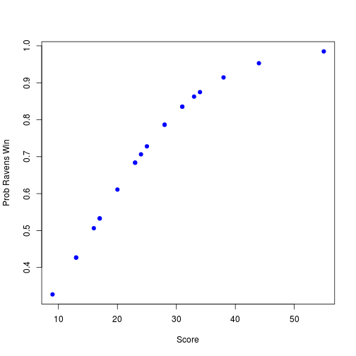
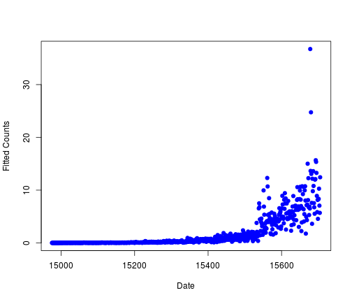
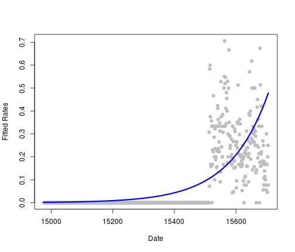

Notes
========================================================

**MD** toolbar button for help on Markdown. **Knit HTML** generates a web page.

General
---------
### Case for R vs SAS

- Private R response: http://www.revolutionanalytics.com/products/revolution-enterprise.php
- Poluparity: *http://r4stats.com/articles/popularity/*, https://sites.google.com/site/r4statistics/popularity
- RevoscaleR: R on multiproc by RA
- In pharma : http://blog.revolutionanalytics.com/2009/02/using-r-in-the-pharmaceutical-industry.html
- Allstate: RevolutionR 50 time faster than SAS: http://blog.revolutionanalytics.com/2012/10/allstate-big-data-glm.html
- Oracle/R link by oracle: http://www.theregister.co.uk/2012/02/10/oracle_advanced_analytics/
- http://www.rdatamining.com/
- R and Hadoop: http://blog.revolutionanalytics.com/2012/03/r-and-hadoop-step-by-step-tutorials.html
- SAS vs R on linedin: http://www.linkedin.com/groups/SAS-versus-R-35222.S.65098787
- http://stats.stackexchange.com/questions/33780/r-vs-sas-why-is-sas-prefered-by-private-companies
- Big Data and OSS: http://techcrunch.com/2012/10/27/big-data-right-now-five-trendy-open-source-technologies/
- http://www.slideshare.net/ianmcook/r-the-good-and-the-bad
- http://en.wikipedia.org/wiki/Comparison_of_statistical_packages

### Biblio
- Standford elements of statistical learning: http://www-stat.stanford.edu/~tibs/ElemStatLearn/
- JHBSM Odd ratios: http://ocw.jhsph.edu/courses/MethodsInBiostatisticsII/PDFs/lecture24.pdf
- http://en.wikipedia.org/wiki/Odds_ratio
- http://en.wikipedia.org/wiki/Poisson_regression
- http://en.wikipedia.org/wiki/Design_of_experiments
- wired A/B : http://www.wired.com/business/2012/04/ff_abtesting/3/

- GLM and glm: http://en.wikipedia.org/wiki/Comparison_of_general_and_generalized_linear_models
- http://en.wikipedia.org/wiki/A/B_testing
- http://hadoop.apache.org/

### Usefull links
- ubuntu one: https://one.ubuntu.com/files/#f=u%2F~%2FDocuments

W5
----
### ANOVA

Outcome is still quantitative
You have multiple explanatory variables
order is important

A/B testing: http://www.wired.com/business/2012/04/ff_abtesting/

Loading data

```r
download.file("http://www.rossmanchance.com/iscam2/data/movies03RT.txt", destfile = "./data/movies.txt")
movies <- read.table("./data/movies.txt", sep = "\t", header = T, quote = "")
head(movies)
```

```
##                  X score rating            genre box.office running.time
## 1 2 Fast 2 Furious  48.9  PG-13 action/adventure     127.15          107
## 2    28 Days Later  78.2      R           horror      45.06          113
## 3      A Guy Thing  39.5  PG-13       rom comedy      15.54          101
## 4      A Man Apart  42.9      R action/adventure      26.25          110
## 5    A Mighty Wind  79.9  PG-13           comedy      17.78           91
## 6 Agent Cody Banks  57.9     PG action/adventure      47.81          102
```


Simple ANOVA

```r
aovObject <- aov(movies$score ~ movies$rating)
aovObject
```

```
## Call:
##    aov(formula = movies$score ~ movies$rating)
## 
## Terms:
##                 movies$rating Residuals
## Sum of Squares            570     28149
## Deg. of Freedom             3       136
## 
## Residual standard error: 14.39 
## Estimated effects may be unbalanced
```

```r
summary(aovObject)
```

```
##                Df Sum Sq Mean Sq F value Pr(>F)
## movies$rating   3    570     190    0.92   0.43
## Residuals     136  28149     207
```

```r
aovObject$coeff
```

```
##        (Intercept)    movies$ratingPG movies$ratingPG-13 
##              67.65             -12.59             -11.81 
##     movies$ratingR 
##             -12.02
```

```r
aovObject2 <- aov(movies$score ~ movies$rating + movies$genre)
aovObject2
```

```
## Call:
##    aov(formula = movies$score ~ movies$rating + movies$genre)
## 
## Terms:
##                 movies$rating movies$genre Residuals
## Sum of Squares            570         3935     24214
## Deg. of Freedom             3           12       124
## 
## Residual standard error: 13.97 
## Estimated effects may be unbalanced
```

```r
summary(aovObject2)
```

```
##                Df Sum Sq Mean Sq F value Pr(>F)  
## movies$rating   3    570     190    0.97  0.408  
## movies$genre   12   3935     328    1.68  0.079 .
## Residuals     124  24214     195                 
## ---
## Signif. codes:  0 '***' 0.001 '**' 0.01 '*' 0.05 '.' 0.1 ' ' 1
```

```r
aovObject4 <- aov(movies$score ~ movies$genre + movies$rating + movies$box.office)
summary(aovObject4)
```

```
##                    Df Sum Sq Mean Sq F value  Pr(>F)    
## movies$genre       12   4222     352    2.19   0.016 *  
## movies$rating       3    284      95    0.59   0.624    
## movies$box.office   1   4421    4421   27.47 6.7e-07 ***
## Residuals         123  19793     161                    
## ---
## Signif. codes:  0 '***' 0.001 '**' 0.01 '*' 0.05 '.' 0.1 ' ' 1
```


Wikipedia on Experimental Design
Wikipedia on ANOVA
Wikipedia on A/B Testing

### Binary outcome

Frequently we care about outcomes that have two values
Called binary outcomes or 0/1 outcomes

Pr(RWi|RSi,b0,b1) = exp(b0 + b1RSi)/1 + exp(b0 + b1RSi)


```r
download.file("https://dl.dropbox.com/u/7710864/data/ravensData.rda", destfile = "./data/ravensData.rda", 
    method = "wget")
load("./data/ravensData.rda")
head(ravensData)
```

```
##   ravenWinNum ravenWin ravenScore opponentScore
## 1           1        W         24             9
## 2           1        W         38            35
## 3           1        W         28            13
## 4           1        W         34            31
## 5           1        W         44            13
## 6           0        L         23            24
```


OR=1: equiv
OR=4
OR=inf: max effect

log reg

```r
logRegRavens <- glm(ravensData$ravenWinNum ~ ravensData$ravenScore, family = "binomial")
summary(logRegRavens)
```

```
## 
## Call:
## glm(formula = ravensData$ravenWinNum ~ ravensData$ravenScore, 
##     family = "binomial")
## 
## Deviance Residuals: 
##    Min      1Q  Median      3Q     Max  
## -1.758  -1.100   0.530   0.806   1.495  
## 
## Coefficients:
##                       Estimate Std. Error z value Pr(>|z|)
## (Intercept)            -1.6800     1.5541   -1.08     0.28
## ravensData$ravenScore   0.1066     0.0667    1.60     0.11
## 
## (Dispersion parameter for binomial family taken to be 1)
## 
##     Null deviance: 24.435  on 19  degrees of freedom
## Residual deviance: 20.895  on 18  degrees of freedom
## AIC: 24.89
## 
## Number of Fisher Scoring iterations: 5
```

```r
exp(logRegRavens$coeff)
```

```
##           (Intercept) ravensData$ravenScore 
##                0.1864                1.1125
```

```r
exp(confint(logRegRavens))
```

```
## Waiting for profiling to be done...
```

```
##                          2.5 % 97.5 %
## (Intercept)           0.005675  3.106
## ravensData$ravenScore 0.996230  1.303
```

```r
anova(logRegRavens)
```

```
## Analysis of Deviance Table
## 
## Model: binomial, link: logit
## 
## Response: ravensData$ravenWinNum
## 
## Terms added sequentially (first to last)
## 
## 
##                       Df Deviance Resid. Df Resid. Dev
## NULL                                     19       24.4
## ravensData$ravenScore  1     3.54        18       20.9
```


Fitted values


```r
plot(ravensData$ravenScore, logRegRavens$fitted, pch = 19, col = "blue", xlab = "Score", 
    ylab = "Prob Ravens Win")
```

 


Simpson paradox+++ see wiki

- Odds ratio of 1 = no difference in odds
- Log odds ratio of 0 = no difference in odds
- Odds ratio < 0.5 or > 2 commonly a "moderate effect"
- Relative risk  often easier to interpret, harder to estimate
- For small probabilities RR  OR but they are not the same!

### poisson regression
#### Count outcome

Many data take the form of counts
Data may also be in the form of rates
Linear regression with transformation is an option

log(outcomeEstimated) = coef * factor + intersect
outcomeEstimated = exp(interstec) * exp(faxtor * coef)

#### fitting rates; example number 

The trick is in the offset parameter. visits+1 because of zeros in coutcome. data parameter to find visits.

Use sandwich/overdispersion if mean <> var (poisson assumption)


```r
#
# download.file('https://dl.dropbox.com/u/7710864/data/gaData.rda',destfile='./data/gaData.rda',method='wget')
load("./data/gaData.rda")
gaData$julian <- julian(gaData$date)

glm2 <- glm(gaData$simplystats ~ julian(gaData$date), offset = log(visits + 
    1), family = "poisson", dat = gaData)
```


pscl allows zero values to validity with log transform log(0)


```r
plot(julian(gaData$date), glm2$fitted, col = "blue", pch = 19, xlab = "Date", 
    ylab = "Fitted Counts")
```

 

```r
points(julian(gaData$date), glm1$fitted, col = "red", pch = 19)
```

```
## Error: object 'glm1' not found
```


```r
plot(julian(gaData$date), gaData$simplystats/(gaData$visits + 1), col = "grey", 
    xlab = "Date", ylab = "Fitted Rates", pch = 19)
lines(julian(gaData$date), glm2$fitted/(gaData$visits + 1), col = "blue", lwd = 3)
```

 


### stepwise


```r
movies <- movies[, -1]
lm1 <- lm(score ~ ., data = movies)
aicFormula <- step(lm1)
```

```
## Start:  AIC=727.5
## score ~ rating + genre + box.office + running.time
## 
##                Df Sum of Sq   RSS AIC
## - genre        12      2575 22132 721
## - rating        3        40 19596 722
## - running.time  1       237 19793 727
## <none>                      19556 728
## - box.office    1      3007 22563 746
## 
## Step:  AIC=720.8
## score ~ rating + box.office + running.time
## 
##                Df Sum of Sq   RSS AIC
## - rating        3       491 22623 718
## <none>                      22132 721
## - running.time  1      1192 23324 726
## - box.office    1      2456 24588 734
## 
## Step:  AIC=717.9
## score ~ box.office + running.time
## 
##                Df Sum of Sq   RSS AIC
## <none>                      22623 718
## - running.time  1       935 23557 722
## - box.office    1      3337 25959 735
```

